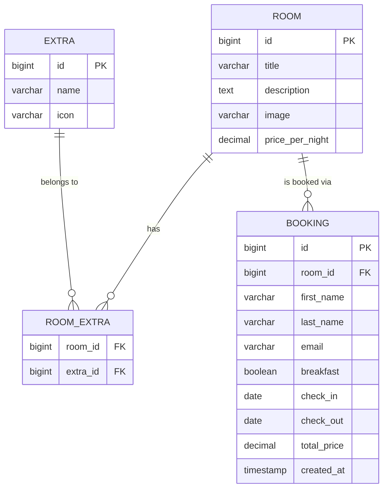

# Database Design – Boutique Hotel Technikum

> **Projekt:** Hotel Booking Interface
> **Version:** 1.0
> **Stand:** 04.05.2026
> **RDBMS:** MySQL

---

## Überblick

Das Datenmodell bildet Hotelzimmer mit ihren Extras, sowie Gästebuchungen ab. Zimmer können mehrere Extras haben (n:m), und Buchungen referenzieren jeweils ein Zimmer für einen bestimmten Zeitraum. Die Datenbank ist auf die Anforderungen der User Stories U1–U5 ausgelegt.

---

## ER-Diagramm



---

## Tabellenbeschreibung

### Tabelle: `room`

Speichert alle Hotelzimmer des Boutique Hotel Technikum.

| Spalte          | Typ           | Constraints        | Beschreibung                                   |
| --------------- | ------------- | ------------------ | ---------------------------------------------- |
| id              | BIGINT        | PK, AUTO_INCREMENT | Eindeutige Zimmer-ID                           |
| title           | VARCHAR(255)  | NOT NULL           | Name des Zimmers (z.B. "Deluxe Suite")         |
| description     | TEXT          | NOT NULL           | Beschreibung des Zimmers                       |
| image           | VARCHAR(255)  | NOT NULL           | Pfad zum Zimmerbild (`/images/rooms/{id}.jpg`) |
| price_per_night | DECIMAL(10,2) | NOT NULL           | Preis pro Nacht in EUR                         |

### Tabelle: `extra`

Speichert mögliche Zimmer-Extras (WiFi, Minibar, Balkon etc.).

| Spalte | Typ          | Constraints        | Beschreibung                                 |
| ------ | ------------ | ------------------ | -------------------------------------------- |
| id     | BIGINT       | PK, AUTO_INCREMENT | Eindeutige Extra-ID                          |
| name   | VARCHAR(100) | NOT NULL, UNIQUE   | Name des Extras (z.B. "WiFi")                |
| icon   | VARCHAR(100) | NOT NULL           | Bootstrap Icon Name (z.B. "wifi", "cup-hot") |

### Tabelle: `room_extra` (Zwischentabelle)

Bildet die n:m-Beziehung zwischen Zimmern und Extras ab.

| Spalte   | Typ    | Constraints              | Beschreibung        |
| -------- | ------ | ------------------------ | ------------------- |
| room_id  | BIGINT | FK → room(id), NOT NULL  | Referenz auf Zimmer |
| extra_id | BIGINT | FK → extra(id), NOT NULL | Referenz auf Extra  |

Primärschlüssel: `(room_id, extra_id)`

### Tabelle: `booking`

Speichert alle Buchungen inkl. Gastdaten und Zeitraum.

| Spalte      | Typ           | Constraints             | Beschreibung                     |
| ----------- | ------------- | ----------------------- | -------------------------------- |
| id          | BIGINT        | PK, AUTO_INCREMENT      | Eindeutige Buchungs-ID           |
| room_id     | BIGINT        | FK → room(id), NOT NULL | Gebuchtes Zimmer                 |
| first_name  | VARCHAR(100)  | NOT NULL                | Vorname des Gastes               |
| last_name   | VARCHAR(100)  | NOT NULL                | Nachname des Gastes              |
| email       | VARCHAR(255)  | NOT NULL                | E-Mail-Adresse des Gastes        |
| breakfast   | BOOLEAN       | NOT NULL, DEFAULT FALSE | Frühstück ja/nein                |
| check_in    | DATE          | NOT NULL                | Anreisedatum                     |
| check_out   | DATE          | NOT NULL                | Abreisedatum                     |
| total_price | DECIMAL(10,2) | NOT NULL                | Gesamtpreis der Buchung          |
| created_at  | TIMESTAMP     | NOT NULL, DEFAULT NOW() | Erstellungszeitpunkt der Buchung |

---

## Beziehungen

| Von  | Zu      | Typ | Beschreibung                                                                           |
| ---- | ------- | --- | -------------------------------------------------------------------------------------- |
| room | extra   | n:m | Ein Zimmer hat mehrere Extras, ein Extra gehört zu mehreren Zimmern (via `room_extra`) |
| room | booking | 1:n | Ein Zimmer kann mehrfach gebucht werden (nicht überlappend)                            |

---

## Indexe

| Tabelle | Spalte(n)           | Typ   | Begründung                                     |
| ------- | ------------------- | ----- | ---------------------------------------------- |
| booking | room_id             | INDEX | Häufige Abfrage: alle Buchungen eines Zimmers  |
| booking | check_in, check_out | INDEX | Verfügbarkeitsprüfung: Überlappung im Zeitraum |
| booking | email               | INDEX | Potentielle spätere Suche nach Gast-Buchungen  |

---

## Verfügbarkeitsprüfung (Query-Logik)

Ein Zimmer ist im Zeitraum `[checkIn, checkOut)` **nicht verfügbar**, wenn eine überlappende Buchung existiert:

```sql
SELECT COUNT(*) FROM booking
WHERE room_id = :roomId
  AND check_in < :checkOut
  AND check_out > :checkIn;
```

Ergebnis > 0 → Zimmer ist belegt.

---

## Beispiel-Testdaten

```sql
-- Extras
INSERT INTO extra (name, icon) VALUES ('WiFi', 'wifi');
INSERT INTO extra (name, icon) VALUES ('Minibar', 'cup-hot');
INSERT INTO extra (name, icon) VALUES ('Balkon', 'door-open');
INSERT INTO extra (name, icon) VALUES ('Safe', 'lock');
INSERT INTO extra (name, icon) VALUES ('Klimaanlage', 'thermometer-snow');
INSERT INTO extra (name, icon) VALUES ('Parkplatz', 'car-front');

-- Zimmer
INSERT INTO room (title, description, image, price_per_night)
VALUES ('Deluxe Suite', 'Geräumige Suite mit Balkon und Bergblick.', '/images/rooms/1.jpg', 149.00);

INSERT INTO room (title, description, image, price_per_night)
VALUES ('Standard Doppelzimmer', 'Komfortables Zimmer für zwei Personen.', '/images/rooms/2.jpg', 89.00);

-- Zimmer-Extras
INSERT INTO room_extra (room_id, extra_id) VALUES (1, 1);
INSERT INTO room_extra (room_id, extra_id) VALUES (1, 2);
INSERT INTO room_extra (room_id, extra_id) VALUES (1, 3);
INSERT INTO room_extra (room_id, extra_id) VALUES (2, 1);
INSERT INTO room_extra (room_id, extra_id) VALUES (2, 4);
```

---
