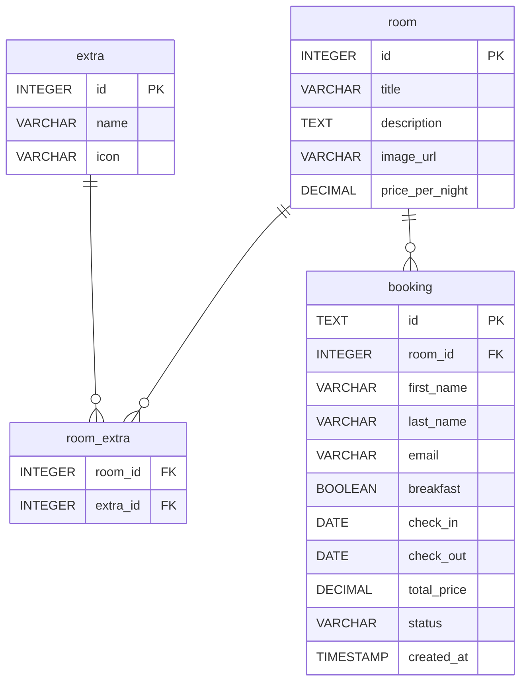

# Boutique Hotel Technikum – Hotel Booking Interface

Semester project for *Advanced Webtechnologies* (MSE 2026).

## Prerequisites

| Tool      | Version | Notes                              |
|-----------|---------|------------------------------------|
| Java JDK  | ≥26     | Backend (Spring Boot)              |
| Node.js   | ≥22     | Frontend (Vue + Ionic)             |
| SQLite CLI| ≥3.47   | Database initialisation (`sqlite3` on PATH) |

Verify with:
```bash
java -version
node --version
sqlite3 --version
```

## Quick Start

```bash
# One-time setup: DB + frontend deps + backend build
./gradlew setup

# Start backend (8080) + frontend (5173) concurrently
./gradlew start
```

Then open http://localhost:5173 in your browser.

## Available Commands

All commands run from the project root using `./gradlew <task>`.

| Command                    | Description                                  |
|----------------------------|----------------------------------------------|
| `./gradlew setup`          | Full one-shot setup (DB + deps + build)      |
| `./gradlew dbInit`         | Delete old SQLite database (Flyway auto-migrates on next startup) |
| `./gradlew frontendInstall`| Install npm dependencies for the frontend     |
| `./gradlew start`          | Start backend + frontend concurrently         |
| `./gradlew startBackend`   | Start only the Spring Boot backend (blocking) |
| `./gradlew startFrontend`  | Start only the Vite frontend (blocking)       |
| `./gradlew :backend:test`    | Run backend tests                             |
| `./gradlew :backend:build`   | Build the backend (compile + test + jar)      |

## API

The backend automatically generates OpenAPI documentation via springdoc-openapi.

| Resource | URL |
|---|---|
| Swagger UI | http://localhost:8080/swagger-ui/index.html |
| OpenAPI JSON | http://localhost:8080/api-docs |

**Endpoints** (all prefixed with `/api`):

| Method | Path | Description |
|--------|------|-------------|
| GET | `/rooms` | Paginated room list (optional `checkIn`, `checkOut` for availability) |
| GET | `/rooms/{id}` | Room details |
| GET | `/rooms/{id}/availability` | Check availability for a date range |
| POST | `/bookings` | Create a booking |
| GET | `/bookings/{id}` | Get booking confirmation |
| PATCH | `/bookings/{id}` | Cancel a booking |

The frontend dev server proxies `/api` requests to `localhost:8080` (configured in `frontend/vite.config.ts`), so no CORS issues during development.

## Frontend Styling

The app uses two layers of CSS on top of Ionic's built-in design system.

| File | Role |
|---|---|
| `frontend/src/theme/variables.css` | Design tokens — colors, spacing, typography, radii, shadows. Overrides Ionic CSS variables (`--ion-color-primary`, etc.) so all Ionic components reflect our brand. |
| `frontend/src/theme/utilities.css` | Reusable utility classes (spacing, layout, text, card, form, wizard) that consume tokens from `variables.css`. Preferred over writing component-scoped CSS. |

**Rule of thumb**: Style via Ionic component props first (e.g. `color="primary"`, `fill="outline"`), reach for utility classes second, and only write scoped `<style>` when neither fits.

## Database

The schema is managed via [Flyway](https://flywaydb.org/) migrations in `backend/src/main/resources/db/migration/`. Production uses SQLite, tests run against H2 in-memory using the same migration.



### Tables

| Table | Description |
|-------|-------------|
| `room` | Hotel rooms with title, description, image URL, price per night |
| `extra` | Bookable extras (WiFi, Minibar, etc.) with name and icon |
| `room_extra` | n:m join table linking rooms to extras |
| `booking` | Guest bookings with dates, guest info, breakfast, total price, and status (CONFIRMED / CANCELLED) |

### Availability query

A room is **not available** for `[checkIn, checkOut]` if an overlapping `CONFIRMED` booking exists:

```sql
SELECT COUNT(*) FROM booking
WHERE room_id = :roomId
  AND status = 'CONFIRMED'
  AND check_in  <= :checkOut
  AND check_out >= :checkIn;
```

Result > 0 → room is occupied. (The `<=` / `>=` comparison correctly handles same-day check-in/check-out for a single-night booking.)

### Build & rebuild

```bash
./gradlew dbInit      # delete old DB files (Flyway auto-migrates on next app startup)
./gradlew :backend:test # runs against H2 in-memory, uses the same Flyway migration
```

