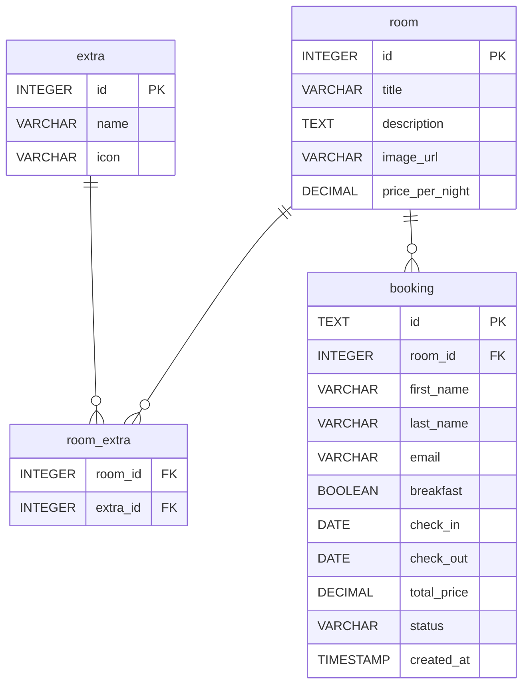

# Database Design – Boutique Hotel Technikum

> **Projekt:** Hotel Booking Interface
> **Version:** 2.0
> **Stand:** 05.05.2026
> **RDBMS:** SQLite (Produktion: MySQL-kompatibel)

---

## Überblick

Das Datenmodell bildet Hotelzimmer mit ihren Extras sowie Gästebuchungen ab. Zimmer können mehrere Extras haben (n:m), und Buchungen referenzieren jeweils ein Zimmer für einen bestimmten Zeitraum. Die Datenbank ist auf die Anforderungen der User Stories U1–U5 ausgelegt.

---

## ER-Diagramm



**Kardinalitäten:** `||` = genau 1 · `o{` = n (0 oder mehr) · `||--o{` = 1 zu n

---

## Tabellenbeschreibung

### Tabelle: `room`

Speichert alle Hotelzimmer des Boutique Hotel Technikum.

| Spalte          | Typ           | Constraints        | Beschreibung                                          |
| --------------- | ------------- | ------------------ | ----------------------------------------------------- |
| id              | INTEGER       | PK, AUTOINCREMENT  | Eindeutige Zimmer-ID                                  |
| title           | VARCHAR(255)  | NOT NULL           | Name des Zimmers (z.B. "Deluxe Suite")                |
| description     | TEXT          | NOT NULL           | Beschreibung des Zimmers                              |
| image_url       | VARCHAR(512)  | NOT NULL           | Absolute URL zum Zimmerbild                           |
| price_per_night | DECIMAL(10,2) | NOT NULL           | Preis pro Nacht in EUR                                |

### Tabelle: `extra`

Speichert mögliche Zimmer-Extras (WiFi, Minibar, Balkon etc.).

| Spalte | Typ          | Constraints       | Beschreibung                                 |
| ------ | ------------ | ----------------- | -------------------------------------------- |
| id     | INTEGER      | PK, AUTOINCREMENT | Eindeutige Extra-ID                          |
| name   | VARCHAR(100) | NOT NULL, UNIQUE  | Name des Extras (z.B. "WiFi")                |
| icon   | VARCHAR(100) | NOT NULL          | Bootstrap Icon Name (z.B. "wifi", "cup-hot") |

### Tabelle: `room_extra` (Zwischentabelle)

Bildet die n:m-Beziehung zwischen Zimmern und Extras ab.

| Spalte   | Typ     | Constraints              | Beschreibung        |
| -------- | ------- | ------------------------ | ------------------- |
| room_id  | INTEGER | FK → room(id), NOT NULL  | Referenz auf Zimmer |
| extra_id | INTEGER | FK → extra(id), NOT NULL | Referenz auf Extra  |

Primärschlüssel: `(room_id, extra_id)`

### Tabelle: `booking`

Speichert alle Buchungen inkl. Gastdaten und Zeitraum.

| Spalte      | Typ           | Constraints                             | Beschreibung                                    |
| ----------- | ------------- | --------------------------------------- | ----------------------------------------------- |
| id          | TEXT          | PK                                      | UUID der Buchung                                |
| room_id     | INTEGER       | FK → room(id), NOT NULL                 | Gebuchtes Zimmer                                |
| first_name  | VARCHAR(100)  | NOT NULL                                | Vorname des Gastes                              |
| last_name   | VARCHAR(100)  | NOT NULL                                | Nachname des Gastes                             |
| email       | VARCHAR(255)  | NOT NULL                                | E-Mail-Adresse des Gastes                       |
| breakfast   | BOOLEAN       | NOT NULL, DEFAULT FALSE                 | Frühstück ja/nein                               |
| check_in    | DATE          | NOT NULL                                | Anreisedatum                                    |
| check_out   | DATE          | NOT NULL, CHECK >= check_in             | Abreisedatum (gleich check_in = 1 Nacht)        |
| total_price | DECIMAL(10,2) | NOT NULL                                | Gesamtpreis inkl. Frühstücksaufpreis            |
| status      | VARCHAR(20)   | NOT NULL, CHECK IN ('CONFIRMED','CANCELLED') | Buchungsstatus                             |
| created_at  | TIMESTAMP     | NOT NULL, DEFAULT NOW()                 | Erstellungszeitpunkt in UTC                     |

---

## Beziehungen

| Von  | Zu         | Typ | Beschreibung                                                                           |
| ---- | ---------- | --- | -------------------------------------------------------------------------------------- |
| room | extra      | n:m | Ein Zimmer hat mehrere Extras, ein Extra gehört zu mehreren Zimmern (via `room_extra`) |
| room | booking    | 1:n | Ein Zimmer kann mehrfach gebucht werden (nicht überlappend)                            |

---

## Indexe

| Tabelle | Spalte(n)           | Typ   | Begründung                                          |
| ------- | ------------------- | ----- | --------------------------------------------------- |
| booking | room_id             | INDEX | Häufige Abfrage: alle Buchungen eines Zimmers       |
| booking | check_in, check_out | INDEX | Verfügbarkeitsprüfung: Überlappung im Zeitraum      |
| booking | email               | INDEX | Potenzielle spätere Suche nach Gast-Buchungen       |
| booking | status              | INDEX | Filtern nach CONFIRMED-Buchungen bei Verfügbarkeit  |

---

## Verfügbarkeitsprüfung (Query-Logik)

Ein Zimmer ist im Zeitraum `[checkIn, checkOut]` **nicht verfügbar**, wenn eine überlappende `CONFIRMED`-Buchung existiert:

```sql
SELECT COUNT(*) FROM booking
WHERE room_id = :roomId
  AND status = 'CONFIRMED'
  AND check_in  <= :checkOut
  AND check_out >= :checkIn;
```

Ergebnis > 0 → Zimmer ist belegt.

> **Hinweis:** `checkIn = checkOut` ist erlaubt und entspricht einer Buchung von einer Nacht (z.B. 21.12. → 22.12.). Die Query verwendet `<=` / `>=` statt `<` / `>` damit dieser Fall korrekt erkannt wird.

---

## Änderungen gegenüber Version 1.0

| Feld / Aspekt           | v1.0                        | v2.0                                      | Grund                                      |
| ----------------------- | --------------------------- | ----------------------------------------- | ------------------------------------------ |
| `booking.id`            | BIGINT AUTO_INCREMENT       | TEXT (UUID)                               | Keine sequenziellen IDs (IDOR-Risiko)      |
| `room.image`            | VARCHAR(255) relativer Pfad | `image_url` VARCHAR(512) absolute URL     | API v2: `imageUrl` als `format: uri`       |
| `booking.status`        | nicht vorhanden             | VARCHAR(20) CHECK IN ('CONFIRMED','CANCELLED') | API v2: Stornierung                   |
| `booking.check_out`     | CHECK > check_in            | CHECK >= check_in                         | checkIn = checkOut erlaubt (= 1 Nacht)     |
| Availability-Query      | `< :checkOut AND > :checkIn` | `<= :checkOut AND >= :checkIn`           | Fix für Same-Day-Buchung                   |
| Index auf `status`      | nicht vorhanden             | `idx_booking_status`                      | Effizientes Filtern bei Verfügbarkeitscheck |
